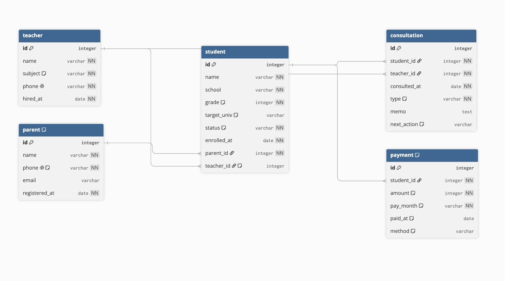

# B6-1 — 입시 학원 고객관리 DB

> 정보를 깔끔하게 정리하는 디지털 서랍장 만들기
> SQL 기반 데이터베이스 설계 · 입력 · 조회 실습

**DBMS**: SQLite 3.45.3 · **테이블** 5개 · **1:N 관계** 5개 · **쿼리** 18개

---

## 1. 실행 방법

```bash
cd B6-1

# 1) 스키마 생성 (테이블 5개)
sqlite3 academy.db < sql/01-schema.sql

# 2) 샘플 데이터 입력
sqlite3 academy.db < sql/02-seed.sql

# 3) 핵심 쿼리 18개 실행 + 결과 저장
sqlite3 academy.db < sql/03-queries.sql > results/03-queries-output.txt

# 4) 보너스 과제 실행 + 결과 저장
sqlite3 academy.db < sql/04-bonus.sql > results/04-bonus-output.txt
```

> `01` → `02` → `03` → `04` 순서로 실행한다.
> `04-bonus.sql` 은 **일부러 에러를 내는 구간(B2)** 이 있어 종료 코드가 `1` 이다. **정상이다.**
> `01-schema.sql` 은 `DROP TABLE IF EXISTS` 로 시작하므로 몇 번이든 다시 돌릴 수 있다.

### 파일 구성

```
B6-1/
├── sql/
│   ├── 01-schema.sql    스키마 생성 (CREATE TABLE + 제약조건)
│   ├── 02-seed.sql      샘플 데이터 (5개 테이블 93행)
│   ├── 03-queries.sql   핵심 쿼리 18개
│   └── 04-bonus.sql     보너스 과제 3종
├── results/
│   ├── 03-queries-output.txt
│   └── 04-bonus-output.txt
├── logs/                실습 증거 로그 (명령 + 실제 출력)
│   ├── 01-environment.log        환경 확인
│   ├── 02-schema-build.log       스키마 생성 + FK 기본 OFF 확인
│   ├── 03-seed-load.log          데이터 입력 + 행 수 검증
│   ├── 04-data-gaps-verify.log   설계 의도 검증 (INNER 14 vs LEFT 15)
│   ├── 05-queries-run.log        쿼리 18개 실행 + 요구사항 대조
│   ├── 06-index-explain.log      인덱스 유/무 실행계획 비교
│   ├── 07-bonus-run.log          보너스 3종
│   └── 08-reproducibility.log    처음부터 재현 확인
├── docs/
│   ├── PLAN.md          기획서 (주제 선정 · ERD · 설계 근거)
│   ├── WORKLOG.md       작업 로그 (막혔던 지점과 해결 과정)
│   ├── CHECKLIST.md     과제 요구사항 체크리스트
│   ├── erd.dbml         ERD 소스 (dbdiagram.io 용)
│   └── erd.png          ERD 다이어그램 이미지
└── academy.db           생성된 DB 파일
```

> 작업 과정과 **막혔던 3가지 문제**는 [`docs/WORKLOG.md`](docs/WORKLOG.md) 에 정리했다.

---

## 2. 주제 — 왜 입시 학원 CRM 인가

학원은 학생을 가르치는 곳이지만, **운영 관점에서는 학부모가 고객이고 상담이 영업이며 결제가 매출**이다.
이 세 축을 분리하면 다음이 자연스럽게 나온다.

- 학생 / 학부모 / 선생님이 **각각 독립적인 개체**로 존재한다.
- "학부모 1명 - 자녀 여러 명", "선생님 1명 - 담당 학생 여러 명"처럼 **1:N 관계가 억지 없이** 만들어진다.
- 담당 인원 균형, 관리 누락 학생, 미납 현황처럼 **실무형 집계 질문**이 명확하다.

### 이 DB로 답하는 질문 3가지

| 질문 | 답하는 쿼리 |
|---|---|
| 선생님별로 업무량이 균형 잡혀 있나? | Q9, Q10, 지표 1 |
| 등록만 하고 **관리에서 빠진 학생**은 누구인가? | Q8, 지표 1 |
| 이번 달 미납 리스크는 얼마인가? | 지표 3 |

---

## 3. 스키마

### ERD



> [dbdiagram.io](https://dbdiagram.io) 로 생성했다. 원본 소스는 [`docs/erd.dbml`](docs/erd.dbml) 이고,
> 수정하려면 그 파일을 dbdiagram.io 에 붙여넣으면 된다.
>
> 선 끝의 표기가 관계의 방향을 보여준다.
> **막대(|) 쪽이 1, 갈래(<) 쪽이 N** 이다. 갈래가 붙은 쪽 테이블이 FK를 가진 자식이다.

<details>
<summary>텍스트 버전 ERD (이미지가 안 보일 때)</summary>

```
  teacher                        parent
  ┌──────────────┐               ┌──────────────┐
  │ id      (PK) │               │ id      (PK) │
  │ name         │               │ name         │
  │ subject      │               │ phone (UQ)   │
  │ phone   (UQ) │               │ email        │
  │ hired_at     │               │ registered_at│
  └──────┬───────┘               └──────┬───────┘
         │ 1                            │ 1
         │ N                            │ N
         └──────────┐      ┌────────────┘
                    ▼      ▼
                  student
                  ┌────────────────────┐
                  │ id            (PK) │
                  │ name, school, grade│
                  │ target_univ        │
                  │ status, enrolled_at│
                  │ parent_id     (FK) │──→ parent.id
                  │ teacher_id    (FK) │──→ teacher.id
                  └───┬────────────┬───┘
                  1   │            │   1
                  N   ▼            ▼   N
            consultation        payment
            ┌──────────────┐    ┌──────────────┐
            │ id      (PK) │    │ id      (PK) │
            │ student_id FK│    │ student_id FK│
            │ teacher_id FK│    │ amount       │
            │ consulted_at │    │ pay_month    │
            │ type, memo   │    │ paid_at      │
            │ next_action  │    │ method       │
            └──────────────┘    └──────────────┘
```

</details>


### 1:N 관계 5개

| # | 관계 | 1쪽 | N쪽 | FK 위치 |
|---|---|---|---|---|
| 1 | 학부모 - 자녀 | `parent` | `student` | `student.parent_id` |
| 2 | 담당 - 학생 | `teacher` | `student` | `student.teacher_id` |
| 3 | 학생 - 상담 | `student` | `consultation` | `consultation.student_id` |
| 4 | 상담자 - 상담 | `teacher` | `consultation` | `consultation.teacher_id` |
| 5 | 학생 - 결제 | `student` | `payment` | `payment.student_id` |

> **FK는 항상 N쪽(자식)에 둔다.**
> 반대로 `parent` 에 `student_id` 를 두면 자녀가 2명인 학부모를 표현할 수 없다.
> 실제로 이 DB에는 자녀가 2명인 학부모가 3명 있다 (Q7에서 확인).

### 데이터 규모

| 테이블 | 행 수 |
|---|---|
| `teacher` | 10 |
| `parent` | 12 |
| `student` | 15 |
| `consultation` | 25 |
| `payment` | 31 |
| **합계** | **93** |

> 위는 `02-seed.sql` 직후 기준이다. `03-queries.sql` 의 Q16(`DELETE`)이 퇴원생의
> 미납 청구 1건을 지우므로 그 이후 `payment` 는 30행이 된다.

---

## 4. 설계할 때 내린 결정과 이유

### 4.1 NULL 허용 여부를 나눈 기준

| 컬럼 | NULL | 이유 |
|---|---|---|
| `student.parent_id` | ❌ NOT NULL | 보호자는 **결제 주체**라 없으면 청구가 불가능하다 |
| `student.teacher_id` | ✅ 허용 | 등록 직후에는 담당이 **아직 안 정해질 수 있다** |
| `student.target_univ` | ✅ 허용 | 목표 대학 미정은 정상적인 상태다 |
| `consultation.next_action` | ✅ 허용 | NULL = "후속 조치 미정" 이라는 **의미 있는 상태** |

### 4.2 `paid_at IS NULL` 하나로 미납을 표현한 이유

`is_paid` 같은 별도 플래그를 두면 **두 값이 어긋날 수 있다.**
(납부일은 들어갔는데 플래그는 `false` 로 남는 경우)
납부일이 없다는 사실 자체가 곧 미납이므로 **컬럼 하나로 통일**했다.

같은 원리로 `student.status` 는 `'재원' / '휴원' / '퇴원'` 한 컬럼이고,
`is_active` 같은 중복 컬럼을 두지 않았다.

### 4.3 CHECK 제약으로 도메인을 좁힌 곳

타입만 지정하면 말이 안 되는 값도 들어간다.

```sql
grade   INTEGER NOT NULL CHECK (grade BETWEEN 1 AND 3)   -- 4학년은 없다
amount  INTEGER NOT NULL CHECK (amount > 0)              -- 0원 청구는 없다
status  TEXT NOT NULL CHECK (status IN ('재원','휴원','퇴원'))
```

### 4.4 복합 UNIQUE

```sql
UNIQUE (student_id, pay_month)
```

같은 학생에게 같은 달 청구서가 두 번 생기면 매출이 부풀려진다.
컬럼 하나가 아니라 **두 컬럼의 조합**이 유일해야 하는 경우다.

### 4.5 `PRAGMA foreign_keys = ON;`

SQLite는 **외래키 제약이 기본으로 꺼져 있다.**
이 줄이 없으면 존재하지 않는 `parent_id` 로 학생을 등록해도 **그냥 통과해 버린다.**
그래서 모든 스크립트 첫 줄에 넣었다.

---

## 5. 샘플 데이터에 일부러 심어둔 "구멍"

데이터가 매끄럽기만 하면 `LEFT JOIN` 을 써도 `INNER JOIN` 과 결과가 같아서
**왜 LEFT를 썼는지 증명할 수 없다.** 그래서 의도적으로 빈자리를 남겼다.

| 심어둔 것 | 개수 | 어떤 쿼리를 위해 |
|---|---|---|
| 자녀가 2명인 학부모 | 3명 | Q7 — 1:N 실증 |
| 담당 선생님 미배정 학생 | 1명 | Q9 LEFT JOIN, Q15 UPDATE 대상 |
| 담당 학생이 0명인 선생님 | 2명 | Q9 — INNER JOIN이면 사라진다 |
| 상담 기록이 0건인 학생 | 2명 | Q8 — `LEFT JOIN + IS NULL` |
| 미납(`paid_at IS NULL`) | 5건 | 지표 3 — 수금 리포트 |
| 후속 조치 미정 상담 | 4건 | Q4 — `IS NULL` 판정 |
| 휴원 / 퇴원 학생 | 각 1명 | Q1 `status` 필터, Q16 DELETE 대상 |

**Q5(INNER JOIN)와 Q9(LEFT JOIN)를 비교해 보면 차이가 그대로 드러난다.**
Q5는 담당이 없는 배시윤이 **명단에서 통째로 빠지고**, Q9는 담당 학생이 0명인
임수빈·한가람 선생님까지 **0으로 표시된다.**

---

## 6. 쿼리 18개 목록

전체 실행 결과: [`results/03-queries-output.txt`](results/03-queries-output.txt)

### 기본 조회 4개 (요구: 4개 이상)

| # | 확인 내용 | 사용 문법 |
|---|---|---|
| Q1 | 고3 재원생 명단 | `WHERE` + `AND` |
| Q2 | 교명에 "여고"가 들어가는 학교의 학생 | `LIKE '%...%'` |
| Q3 | 가장 최근 등록한 학생 5명 | `ORDER BY DESC` + `LIMIT` |
| Q4 | 후속 조치가 정해지지 않은 상담 건 | `IS NULL` |

### 조인 5개 (요구: 4개 이상 / INNER 2+ / LEFT 1+)

| # | 확인 내용 | 종류 |
|---|---|---|
| Q5 | 학생 - 보호자 연락처 - 담당 선생님 통합 명단 | `INNER JOIN` ×2 |
| Q6 | 최근 상담 기록 상세 (누가/누구를/언제) | `INNER JOIN` ×2 |
| Q7 | 자녀를 2명 이상 보낸 학부모 | `INNER JOIN` + `HAVING` |
| Q8 | **상담을 한 번도 받지 못한 학생** | `LEFT JOIN` + `IS NULL` |
| Q9 | 담당 학생 0명인 선생님까지 포함한 배정 현황 | `LEFT JOIN` |

### 집계 4개 (요구: 3개 이상 / 함수 2종 이상 + GROUP BY)

| # | 확인 내용 | 함수 |
|---|---|---|
| Q10 | 선생님별 상담 진행 건수 랭킹 | `COUNT` |
| Q11 | 월별 상담 건수 추이 | `COUNT` + `SUBSTR` |
| Q12 | 총 납부액 100만원 이상 학생 | `SUM` + `HAVING` |
| Q13 | 학년별 1인당 평균 납부액 | `AVG` |

### 서브쿼리 1개 (요구: 1개 이상)

| # | 확인 내용 |
|---|---|
| Q14 | 평균보다 상담을 많이 받은 학생 |

### 수정 및 삭제 2개 (요구: 2개 이상)

| # | 확인 내용 |
|---|---|
| Q15 | 담당 미배정 학생에게 담당 선생님 배정 (`UPDATE`) |
| Q16 | 퇴원생의 미납 청구 건 삭제 (`DELETE`) |

> `UPDATE` / `DELETE` 는 **같은 `WHERE` 로 `SELECT` 를 먼저 돌려 대상을 확인**한 뒤 실행한다.
> 스크립트에도 (변경 전) / (변경 후) 를 같이 출력하도록 해 두었다.
> `WHERE` 를 빠뜨리면 테이블 전체가 바뀐다.

### 인덱스 2개 (요구: 1개 이상 + 이유 1줄)

| # | 인덱스 | 적용 이유 |
|---|---|---|
| Q17 | `idx_consultation_student` on `consultation(student_id)` | 상담 조회는 거의 항상 "이 학생의 상담"이라 `student_id` 로 필터·조인한다 (Q6/Q8/Q14) |
| Q18 | `idx_payment_month` on `payment(pay_month)` | 월별 매출 집계에서 매번 `pay_month` 로 묶고 거른다 (월말 정산) |

**인덱스가 실제로 쓰이는지 실행계획으로 확인했다.**

```
sqlite> EXPLAIN QUERY PLAN SELECT * FROM consultation WHERE student_id = 1;
`--SEARCH consultation USING INDEX idx_consultation_student (student_id=?)

sqlite> EXPLAIN QUERY PLAN SELECT pay_month, SUM(amount) FROM payment GROUP BY pay_month;
`--SCAN payment USING INDEX idx_payment_month
```

`SCAN ... USING INDEX` 가 아니라 그냥 `SCAN payment` 였다면 인덱스를 안 탄 것이다.

> **인덱스는 공짜가 아니다.** 읽기는 빨라지지만 `INSERT`/`UPDATE` 때마다 색인도
> 갱신해야 해서 **쓰기는 느려진다.** 값 종류가 몇 개 안 되는 컬럼(`status` 같은)에
> 걸면 효과가 거의 없다. PK와 UNIQUE에는 이미 인덱스가 자동 생성된다.

---

## 7. 보너스 과제

전체 실행 결과: [`results/04-bonus-output.txt`](results/04-bonus-output.txt)

### B1. 같은 요구를 세 방식으로 — 그리고 `NOT IN` 의 함정

"상담을 한 번도 받지 못한 학생" 을 세 가지로 풀었다.

| 방식 | 실행계획 |
|---|---|
| `LEFT JOIN` + `IS NULL` | `SEARCH c USING COVERING INDEX ... LEFT-JOIN` |
| `NOT IN (SELECT ...)` | `USING INDEX ... FOR IN-OPERATOR` |
| `NOT EXISTS (SELECT 1 ...)` | `CORRELATED SCALAR SUBQUERY` |

세 결과는 같았다. **하지만 서브쿼리가 보는 컬럼에 NULL 이 섞이면 `NOT IN` 만 조용히 무너진다.**

`teacher_id` 는 NULL 을 허용하므로 담당 미배정 학생을 한 명 만들고 같은 질문을 던졌다.

```sql
-- (A) NOT IN  → 0행. 담당 학생 없는 선생님이 분명히 2명 있는데 아무것도 안 나온다
SELECT t.name FROM teacher t WHERE t.id NOT IN (SELECT teacher_id FROM student);

-- (B) NOT EXISTS → 임수빈, 한가람 정상 출력
SELECT t.name FROM teacher t
WHERE NOT EXISTS (SELECT 1 FROM student s WHERE s.teacher_id = t.id);

-- (C) NOT IN 을 고치려면 서브쿼리에서 NULL 을 먼저 걸러야 한다 → 정상 출력
SELECT t.name FROM teacher t
WHERE t.id NOT IN (SELECT teacher_id FROM student WHERE teacher_id IS NOT NULL);
```

**왜 0행이 되나**: `NOT IN` 은 내부적으로
`(t.id <> v1 AND t.id <> v2 AND ...)` 로 풀린다.
`v` 중 하나가 `NULL` 이면 그 비교는 TRUE 도 FALSE 도 아닌 **UNKNOWN** 이 되고,
`AND` 로 묶인 전체가 절대 TRUE 가 될 수 없어 **모든 행이 탈락한다.**
에러도 안 나고 결과만 조용히 비기 때문에 가장 찾기 어려운 버그다.

> **결론**: "없는 것 찾기" 는 `LEFT JOIN + IS NULL` 또는 `NOT EXISTS` 를 쓴다.

### B2. 데이터 정합성 일부러 깨뜨려 보기

5가지를 시도했고 **전부 막혔다.** 행 수는 그대로(학생 15, 학부모 12) 유지됐다.

| 시도 | 실제 에러 메시지 | 왜 막히나 | 어떻게 고치나 |
|---|---|---|---|
| 없는 학부모(id=999)로 학생 등록 | `FOREIGN KEY constraint failed` | `parent` 에 999번이 없다 | 학부모를 먼저 INSERT 하고 그 id 를 쓴다 |
| 이미 쓰는 전화번호로 학부모 추가 | `UNIQUE constraint failed: parent.phone` | 같은 번호가 두 고객이면 식별 불가 | 기존 고객인지 조회 후 `UPDATE` 로 처리 |
| 이름 없이 학생 등록 | `NOT NULL constraint failed: student.name` | 이름 없는 학생은 의미가 없다 | 이름을 필수 입력으로 받는다 |
| 자녀가 남은 학부모 삭제 | `FOREIGN KEY constraint failed` | 자식이 아직 그 부모를 가리킨다 | 자녀를 먼저 이전/삭제한 뒤 지운다 |
| 학년에 4 입력 | `CHECK constraint failed: grade BETWEEN 1 AND 3` | 고등학교에 4학년은 없다 | `CHECK` 로 도메인을 좁혀 둔다 |

> 앞의 두 FK 에러는 **`PRAGMA foreign_keys = ON;` 이 있어야만 발생한다.**
> 이 줄을 빼고 돌리면 유령 학생이 그대로 들어가 버린다.

### B3. 미니 리포트 — 핵심 지표 3개

| 지표 | 무엇을 보나 | 실제 결과 |
|---|---|---|
| **1. 선생님별 업무 현황** | 담당 학생 수와 상담 건수를 나란히 놓아 **관리 공백**을 찾는다 | 박준호 3명/7건 vs 임수빈 1명/0건, 한가람 0명/0건 |
| **2. 월별 상담 활동량 (유형별)** | 신규 유입(입학상담) 대 기존 관리의 **비중 변화** | 6월 입학상담 7건 → 9월 0건. 대신 진로상담 4건. **신규 유입이 멈췄다** |
| **3. 미납 현황** | 보호자 연락처까지 붙여 **바로 전화할 수 있는 형태** + 월별 미납률 | 미납률 7월 0% → 8월 9.4% → **9월 31.2%** |

지표 2와 3이 같은 방향을 가리킨다: **9월 들어 신규 상담이 끊기고 미납률이 급등했다.**
테이블을 나눠 저장했기 때문에 상담 데이터와 결제 데이터를 각각 집계해
이런 교차 해석이 가능해진다.

---

## 8. 배운 것

### DB가 엑셀과 뭐가 다른가

엑셀 한 장에 "학생 이름, 보호자 이름, 보호자 연락처, 상담일, 상담 내용" 을 다 적으면
**같은 학생의 상담이 4건이면 보호자 연락처도 4번 적힌다.** 번호를 바꾸려면 4줄을
전부 고쳐야 하고, 하나라도 빠뜨리면 **같은 사람 연락처가 두 개**가 된다.
자녀가 2명인 학부모는 더 심해진다.

DB는 **같은 정보를 한 군데에만 두고 나머지는 그걸 가리키게** 한다.
가리키는 장치가 FK, 다시 합쳐 보는 게 JOIN이다.
이 DB에서 김미경 씨 연락처는 `parent` 에 **딱 한 줄** 있고,
자녀 김도윤·김하율은 `parent_id = 1` 로 그것을 가리킬 뿐이다.

### SELECT 실행 순서

적는 순서와 실행 순서가 다르다.

```
적는 순서:  SELECT → FROM → WHERE → GROUP BY → HAVING → ORDER BY → LIMIT
실행 순서:  FROM → WHERE → GROUP BY → HAVING → SELECT → ORDER BY → LIMIT
             ①      ②       ③          ④        ⑤        ⑥        ⑦
```

Q12에서 이게 그대로 드러난다.

```sql
WHERE  pm.paid_at IS NOT NULL      -- ② 묶기 전: 개별 행(실제 납부 건만) 거르기
GROUP BY s.id, s.name
HAVING SUM(pm.amount) >= 1000000   -- ④ 묶은 후: 그룹 거르기
```

`WHERE SUM(...) >= 1000000` 은 불가능하다. `WHERE`(②) 시점에는 아직 그룹이 없기 때문이다.
반대로 `ORDER BY 총납부액`(⑥)은 `SELECT`(⑤) 다음이라 별칭을 쓸 수 있다.

### GROUP BY 철칙

**`SELECT` 에는 `GROUP BY` 에 넣은 컬럼이나 집계 함수만 올 수 있다.**
SQLite는 봐주지만 MySQL·PostgreSQL은 에러다. 그래서 이 과제에서는
`GROUP BY s.id, s.name` 처럼 **SELECT에 쓴 컬럼을 전부 GROUP BY에 명시**했다.

### NULL은 `=` 로 못 찾는다

`WHERE returned_at = NULL` 은 항상 0행이다. NULL은 "값이 없음" 이라 무엇과도 같지 않다.
반드시 `IS NULL` / `IS NOT NULL` 을 쓴다. 이 함정의 확장판이 B1의 `NOT IN` 문제다.

---

## 9. 제약 사항 준수

- ✅ 백엔드 프레임워크 미사용 (SQL 스크립트만)
- ✅ 로컬 실행 DB (SQLite, 파일 기반)
- ✅ **뷰(View) / 프로시저 / 트리거 사용하지 않음**
- ✅ 정규화 이론을 과도하게 파지 않고 "관계가 자연스럽고 쿼리가 잘 나오는 구조" 에 집중
- ✅ DB 고유 문법은 주석으로 명시

### 사용한 DB 고유 문법

| 문법 | 어디에 | 다른 DBMS에서는 |
|---|---|---|
| `PRAGMA foreign_keys = ON` | 모든 스크립트 첫 줄 | MySQL/PostgreSQL은 FK가 기본 활성 |
| `AUTOINCREMENT` | 모든 PK | MySQL `AUTO_INCREMENT`, PostgreSQL `SERIAL` |
| `GROUP_CONCAT()` | Q7 | 표준은 `STRING_AGG()`, MySQL은 동일 |
| `EXPLAIN QUERY PLAN` | Q17/Q18 검증 | MySQL/PostgreSQL은 `EXPLAIN` |
| `.headers` / `.mode` / `.print` / `.bail` | 출력 서식 | sqlite3 CLI 전용, 지워도 SQL은 동작 |

`SUBSTR`, `CASE WHEN`, `ROUND`, `COUNT/SUM/AVG`, `HAVING`, `LEFT JOIN`,
`NOT EXISTS`, `CHECK`, `UNIQUE` 는 전부 표준 SQL 범위다.
