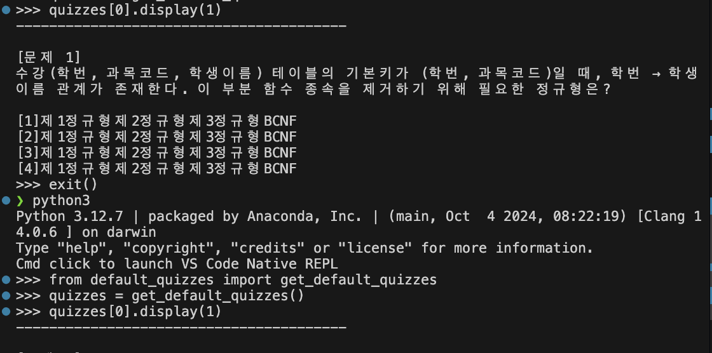
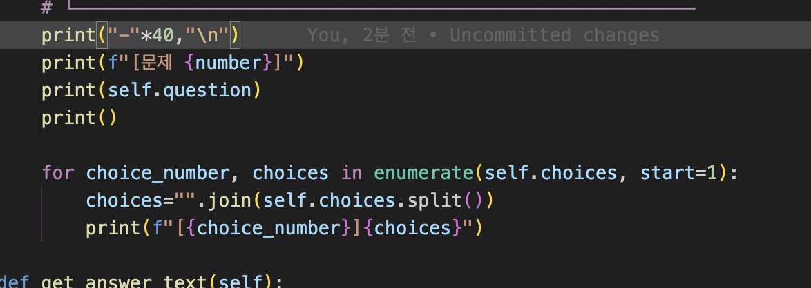
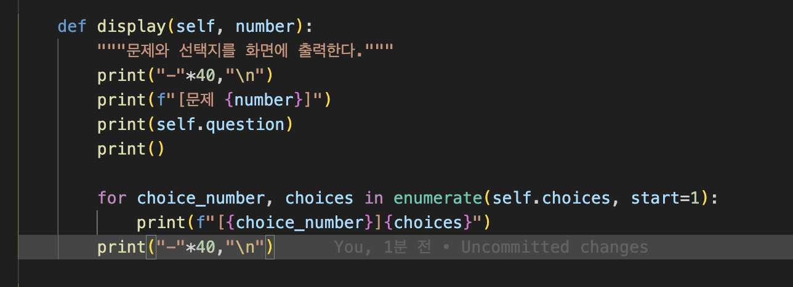
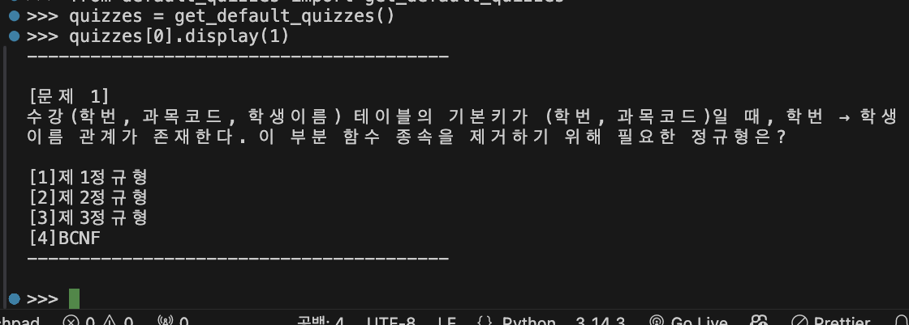

# SQLD 퀴즈 게임

Python 기본 문법과 객체 지향 설계, JSON 파일 입출력, Git 작업 흐름을
연습하기 위해 만든 터미널 기반 퀴즈 프로그램입니다.

- GitHub: https://github.com/Dong-tak/codyssey/tree/main/E1-2/quiz-game-practice
- 제출 및 검증 자료: [docs/SUBMISSION_EVIDENCE.md](docs/SUBMISSION_EVIDENCE.md)

## 설명 순서

발표할 때는 아래 순서로 설명하면 프로젝트의 목적부터 구현 근거까지 자연스럽게
이어집니다.

1. **프로젝트 소개** — 무엇을 만들었고 왜 SQLD를 주제로 정했는지 설명
2. **실행 준비** — 환경과 실행 명령을 보여 준 뒤 프로그램 실행
3. **프로그램 내부 동작 흐름** — 시작 과정과 메뉴 1~5번의 메서드 호출 설명
4. **코드 구조와 역할** — 파일과 클래스의 책임 및 의존 방향 설명
5. **데이터 저장과 복원** — `state.json` 구조와 JSON 변환 설명
6. **Git 작업 과정** — 기능 커밋, 브랜치·병합, clone·pull 증거 설명
7. **트러블슈팅** — 실제 문제를 발견하고 해결한 과정 설명

1~6번은 프로젝트 소개와 구현 근거를 설명하는 기본 발표 순서이고,
7번은 실제 문제 해결 과정을 설명할 때 활용할 수 있습니다.

## 1. 프로젝트 소개

### 프로젝트 개요

메뉴에서 퀴즈 풀기, 새 퀴즈 추가, 퀴즈 목록 확인, 최고 점수 확인 기능을
선택할 수 있습니다. 사용자가 추가한 퀴즈와 최고 점수는 프로젝트 루트의
`state.json`에 저장되므로 프로그램을 종료한 뒤 다시 실행해도 유지됩니다.

### 퀴즈 주제와 선정 이유

퀴즈 주제는 SQL 개발자 자격시험(SQLD) 학습입니다. 정규화, 그룹 함수,
JOIN, NULL, 트랜잭션처럼 혼동하기 쉬운 개념을 짧은 객관식 문제로 반복해서
확인하기 위해 이 주제를 선택했습니다.

기본 문제 5개와 선택지는 학습용으로 직접 작성했으며, 사용자가 새로운
문제를 계속 추가할 수 있도록 구성했습니다.

### 주요 기능

- SQLD 기본 퀴즈 5개 제공
- 풀 문제 수를 사용자가 선택
- `random.sample()`을 이용한 무작위 출제
- 객관식 선택지 출력과 정답·오답 판정
- 퀴즈 풀이 후 맞힌 문제 수 출력 및 최고 점수 갱신
- 점수 확인 메뉴에서 최고 점수 출력
- 문제, 선택지 4개, 정답 번호를 입력받아 새 퀴즈 추가
- 등록된 퀴즈 목록 확인
- 퀴즈가 없거나 아직 게임을 하지 않은 상태 처리
- 퀴즈와 최고 점수를 UTF-8 JSON 파일로 저장·복원
- 저장 파일이 없거나 손상된 경우 기본 퀴즈로 실행
- Ctrl+C 또는 EOF 발생 시 현재 상태를 저장하고 안전하게 종료

## 2. 실행 준비

### 실행 환경

- Python 3.10 이상
- 외부 라이브러리 없음
- Python 표준 라이브러리 `json`, `os`, `random` 사용
- 실제 환경 확인: [Python·Git 버전과 Git 사용자 설정](docs/screenshots/env-python-git.png)

### 실행 방법

저장소를 내려받은 뒤 프로젝트 디렉터리에서 다음 명령을 실행합니다.

```bash
cd quiz-game-practice
python3 main.py
```

실행하면 다음 메뉴가 표시됩니다.

```text
========================================
        퀴즈 게임
========================================
1. 퀴즈 풀기
2. 퀴즈 추가
3. 퀴즈 목록
4. 점수 확인
5. 종료
========================================
```

실제 실행 화면: [메인 메뉴](docs/screenshots/menu.png)

숫자를 입력하는 곳에서는 앞뒤 공백, 빈 입력, 문자 입력, 허용 범위를 벗어난
입력을 검사하며 올바른 값이 들어올 때까지 다시 입력받습니다.

## 3. 프로그램 내부 동작 흐름

### 프로그램 시작 공통 흐름

```text
python3 main.py
→ main.py의 if __name__ == "__main__" 조건 확인
→ main()
→ QuizGame() 객체 생성
  → QuizGame.__init__()
    → get_default_quizzes()로 기본 퀴즈 준비
    → best_score = 0, has_played = False로 기본 상태 준비
    → QuizGame.load()
      → state.json이 정상이면 json.load()로 읽기
      → Quiz.from_dict()로 각 딕셔너리를 Quiz 객체로 복원
      → 검증이 끝난 퀴즈·최고 점수·응시 상태 반영
      → 파일이 없거나 손상됐다면 처음 준비한 기본 상태 유지
→ QuizGame.run()
→ QuizGame.show_menu()
→ input_int("선택: ", 1, 5)로 메뉴 번호 검증
→ 입력한 1~5번에 따라 기능 메서드 호출
```

`run()`은 선택한 기능이 끝나면 다시 `show_menu()`를 호출합니다. 따라서
5번으로 반복을 끝내거나 Ctrl+C·EOF가 발생하기 전까지 메뉴가 계속
표시됩니다.

| 메뉴         | 처음 호출되는 메서드      | 주요 호출 흐름                                                             | 즉시 저장 |
| ------------ | ------------------------- | -------------------------------------------------------------------------- | --------- |
| 1. 퀴즈 풀기 | `QuizGame.play_quiz()`    | `input_int()` → `random.sample()` → `Quiz.display()` → `Quiz.is_correct()` | O         |
| 2. 퀴즈 추가 | `QuizGame.add_quiz()`     | `input_text()` → `input_int()` → `Quiz()` → `list.append()`                | O         |
| 3. 퀴즈 목록 | `QuizGame.list_quizzes()` | 퀴즈 목록을 `enumerate()`로 순회해 출력                                    | X         |
| 4. 점수 확인 | `QuizGame.check_score()`  | `has_played` 확인 → `best_score` 출력                                      | X         |
| 5. 종료      | `run()`의 종료 분기       | `break` → `finally` → `QuizGame.save()`                                    | O         |

### 1번: 퀴즈 풀기

```text
QuizGame.run()
→ QuizGame.play_quiz()
→ 등록된 퀴즈가 없으면 안내 후 run()으로 복귀
→ input_int()로 풀 문제 수 입력·검증
→ random.sample()로 중복 없이 무작위 문제 선택
→ 선택한 퀴즈를 반복
  → Quiz.display()로 문제와 선택지 출력
  → input_int()로 정답 번호 입력·검증
  → Quiz.is_correct()로 정답 여부 확인
    ├─ 정답: score를 1 증가
    └─ 오답: Quiz.get_answer_text()로 정답 문구 출력
→ 최종 정답 수 출력
→ has_played = True로 변경
→ 기존 best_score보다 높으면 최고 점수 갱신
→ QuizGame.save()
→ run()으로 복귀
→ show_menu()로 메뉴 다시 출력
```

### 2번: 퀴즈 추가

```text
QuizGame.run()
→ QuizGame.add_quiz()
→ input_text()로 문제 내용 입력·검증
→ input_text()를 4번 호출해 선택지 입력·검증
→ input_int()로 1~4 범위의 정답 번호 입력·검증
→ Quiz(question, choices, answer)로 새 객체 생성
→ self.quizzes.append()로 퀴즈 목록에 추가
→ QuizGame.save()
→ 추가 완료 메시지 출력
→ run()으로 복귀
→ show_menu()로 메뉴 다시 출력
```

### 3번: 퀴즈 목록

```text
QuizGame.run()
→ QuizGame.list_quizzes()
→ 등록된 퀴즈가 없으면 안내 후 run()으로 복귀
→ 전체 퀴즈 수 출력
→ enumerate(self.quizzes, start=1)로 목록 순회
→ 각 문제의 줄바꿈·연속 공백을 한 칸으로 정리
→ 번호와 문제 내용을 한 줄씩 출력
→ run()으로 복귀
→ show_menu()로 메뉴 다시 출력
```

목록 확인은 데이터를 바꾸지 않으므로 이 메서드에서는 `save()`를 호출하지
않습니다.

### 4번: 점수 확인

```text
QuizGame.run()
→ QuizGame.check_score()
→ has_played 확인
  ├─ False: "아직 퀴즈를 풀지 않았습니다." 출력
  └─ True: best_score 출력
→ run()으로 복귀
→ show_menu()로 메뉴 다시 출력
```

점수 확인도 데이터를 변경하지 않으므로 `save()`를 호출하지 않습니다.

### 5번: 종료

```text
QuizGame.run()
→ "게임을 종료합니다." 출력
→ while 반복문을 break로 종료
→ run()의 finally 실행
→ QuizGame.save()로 현재 상태 저장
→ game.run() 종료
→ main() 종료
→ 프로그램 종료
```

Ctrl+C 또는 EOF가 발생했을 때도 `run()`의 `except`가 중단을 처리한 뒤
`finally`에서 `save()`를 호출하므로 같은 안전 종료 흐름을 거칩니다.

### 공통 저장 세부 흐름

1번과 2번은 데이터가 변경된 직후 저장하며, 5번과 Ctrl+C·EOF 종료에서도
한 번 더 저장합니다.

```text
QuizGame.save()
→ 모든 Quiz 객체에 Quiz.to_dict() 호출
→ quizzes, best_score, has_played를 save_data 딕셔너리로 구성
→ state.json을 UTF-8 쓰기 모드로 열기
→ json.dump(ensure_ascii=False, indent=2)로 기록
→ 쓰기 실패 시 OSError 안내
```

## 4. 코드 구조와 역할

```text
quiz-game-practice/
├── main.py                 # 프로그램 진입점
├── quiz.py                 # Quiz 클래스와 JSON 변환
├── quiz_game.py            # 메뉴, 게임 흐름, 점수, 저장·불러오기
├── default_quizzes.py      # SQLD 기본 퀴즈 5개
├── utils.py                # 공통 입력 및 검증
├── state.json              # 실행 중 생성되는 사용자 데이터
├── logs/                   # 기능 구현과 테스트 기록
├── docs/
│   ├── SUBMISSION_EVIDENCE.md # 제출 증거 안내
│   └── screenshots/        # 실행 및 트러블슈팅 증거 이미지
└── README.md
```

의존 방향은 아래로만 흐르도록 역할을 분리했습니다.

```text
main.py
   └── quiz_game.py
       ├── quiz.py
       ├── default_quizzes.py
       └── utils.py
```

- `Quiz`: 문제 하나의 데이터, 출력, 정답 판정, 딕셔너리 변환 담당
- `QuizGame`: 여러 퀴즈와 최고 점수를 보유하고 전체 게임 흐름 담당
- `utils.py`: 퀴즈의 내용을 알지 못한 채 공통 입력 검증만 담당

## 5. 데이터 저장과 복원

`state.json`은 프로젝트 루트에 UTF-8로 저장됩니다. 첫 실행처럼 파일이
없으면 `default_quizzes.py`의 기본 퀴즈를 사용합니다. 파일 내용이
손상되거나 읽을 수 없으면 오류를 처리하고 기본 퀴즈로 복구합니다.

저장 구조는 다음과 같습니다.

```json
{
  "quizzes": [
    {
      "question": "문제 내용",
      "choices": ["선택지 1", "선택지 2", "선택지 3", "선택지 4"],
      "answer": 2
    }
  ],
  "best_score": 0,
  "has_played": false
}
```

- `answer`: 화면에 표시되는 번호와 동일하게 1부터 4까지 저장
- `best_score`: 한 번의 게임에서 가장 많이 맞힌 문제 수
- `has_played`: 0점과 아직 퀴즈를 풀지 않은 상태를 구분
- `Quiz.to_dict()`: `Quiz` 객체를 JSON으로 저장 가능한 딕셔너리로 변환
- `Quiz.from_dict()`: JSON에서 읽은 딕셔너리를 다시 `Quiz` 객체로 복원

`state.json`은 실행 중 만들어지는 개인 데이터이므로 Git에는 포함하지
않도록 `.gitignore`에 등록했습니다.

## 6. Git 작업 과정

기능 단위로 커밋했으며, 퀴즈 풀기 기능은 `feature/play-quiz` 브랜치에서
구현한 뒤 `main` 브랜치에 병합했습니다.

- 브랜치와 병합 결과: [Git 그래프](docs/screenshots/git-graph.png)
- clone/push/pull 화면: [실습 기록](docs/screenshots/clone-pull.png)
- 전체 명령과 출력: [clone/pull 상세 로그](logs/07-clone-pull.log)

### Clone/Pull 실습 확인

이 문장은 2026-08-11 별도 clone 디렉터리에서 작성하고 커밋한 변경입니다.
기존 개발 디렉터리에서 `git pull`로 이 문장을 가져와 실습을 확인합니다.

## 7. 트러블슈팅

### 선택지 전체가 각 번호에 반복 출력되는 문제

#### 증상

`Quiz.display()`를 테스트했을 때, 각 번호에 현재 선택지 하나가 아니라 선택지 4개를 합친 문자열이 반복 출력되었다.

```text
[1]제1정규형제2정규형제3정규형BCNF
[2]제1정규형제2정규형제3정규형BCNF
[3]제1정규형제2정규형제3정규형BCNF
[4]제1정규형제2정규형제3정규형BCNF
```



#### 원인

`for`문은 선택지를 하나씩 꺼내고 있었지만, 반복문 안에서 `self.choices` 전체를 `join()`하여 현재 선택지 변수를 덮어썼다. `self.choices`는 선택지 전체가 들어 있는 리스트이고, `choice`는 반복문에서 꺼낸 현재 선택지 하나이다.



#### 해결

`join()` 처리를 제거하고 반복문이 꺼낸 `choice`를 그대로 출력했다.

```python
for choice_number, choice in enumerate(self.choices, start=1):
    print(f"{choice_number}. {choice}")
```



#### 확인

Python REPL에서 기본 퀴즈의 첫 문제를 직접 출력해 선택지가 한 번씩만 나오는지 확인했다. 코드를 수정한 뒤에는 REPL을 종료하고 다시 실행해 수정된 모듈을 불러왔다.


