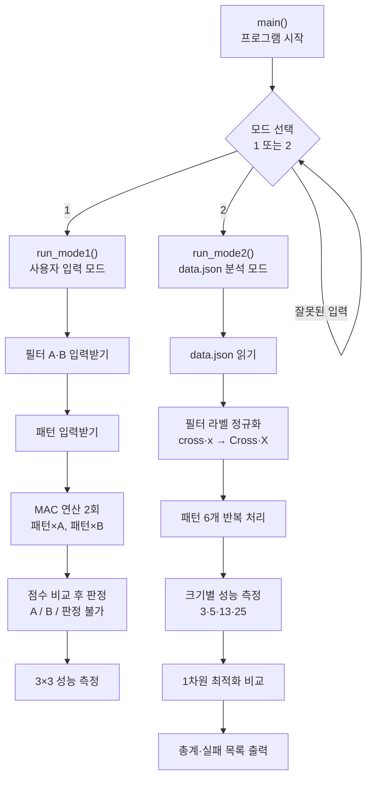
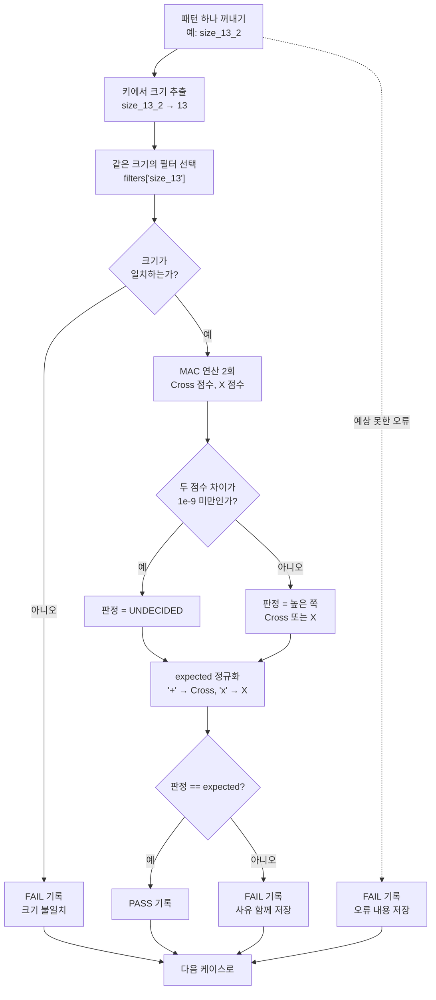

# Mini NPU Simulator

MAC(Multiply-Accumulate) 연산으로 2차원 패턴이 십자가(Cross)인지 X인지 판별하고,
패턴 크기에 따른 연산 시간 변화를 실측해 O(N²) 를 확인하는 파이썬 콘솔 프로그램입니다.

- **개발 환경**: Python 3.8 이상 (검증 환경 3.12.7)
- **외부 라이브러리 없음** — 표준 라이브러리(`json`, `time`)만 사용

---

## 1. 실행 방법

```bash
cd E1-3
python3 main.py
```

실행하면 모드를 선택합니다.

```
=== Mini NPU Simulator ===

[모드 선택]
1. 사용자 입력 (3x3)
2. data.json 분석
선택:
```

| 모드 | 설명 |
|---|---|
| **1** | 3×3 필터 A·B 와 패턴을 직접 입력해 즉석 판정 |
| **2** | `data.json` 의 5×5 / 13×13 / 25×25 케이스를 일괄 검증 |

### data.json 위치

`main.py` 와 **같은 폴더**에 있어야 합니다. 파일이 없거나 JSON 형식이 깨져 있으면
안내 메시지를 출력하고 프로그램은 정상 종료됩니다.

### 모드 1 입력 형식

한 줄에 숫자 3개를 공백으로 구분해 3줄씩 입력합니다.

```
필터 A (3줄 입력, 공백 구분)
0 1 0
1 1 1
0 1 0

필터 B (3줄 입력, 공백 구분)
1 0 1
0 1 0
1 0 1

패턴 (3줄 입력, 공백 구분)
1 0 1
0 1 0
1 0 1
```

결과:

```
A 점수: 1.0
B 점수: 5.0
연산 시간(평균/10회): 0.001 ms
판정: B
```

행/열 개수가 맞지 않거나 숫자가 아닌 값을 넣으면 안내 후 그 줄만 다시 받습니다.

```
입력 형식 오류: 각 줄에 3개의 숫자를 공백으로 구분해 입력하세요.
```

---

## 2. 전체 코드 흐름

### 2-1. 실행 순서 한눈에 보기



### 2-2. 모드 2의 케이스 처리 (핵심 루프)

패턴 하나를 처리하는 과정입니다. **어느 단계에서 실패해도 그 케이스만 FAIL로 적고
다음 케이스로 넘어갑니다.** 프로그램 전체가 멈추지 않는 것이 핵심입니다.



> UNDECIDED는 `Cross`도 `X`도 아니므로 **어떤 expected와도 같을 수 없어 반드시 FAIL**이
> 됩니다. 이것이 실패 3건이 나오는 경로입니다.

### 2-3. 함수 호출 관계

어떤 함수가 어떤 함수를 부르는지 나타낸 것입니다. 아래로 갈수록 더 작은 단위입니다.

```
main()
├── run_mode1()                    모드 1 전체 흐름
│   ├── read_matrix()              n줄 입력받아 격자 만들기
│   │   └── parse_row()            한 줄 → 숫자 리스트 (검증 포함)
│   ├── mac()                      MAC 연산
│   ├── decide()                   점수 비교 후 판정
│   ├── measure()                  평균 연산 시간 측정
│   │   └── mac()
│   ├── print_section()            단계 구분 헤더 출력
│   └── print_perf_table()         성능 표 출력
│
└── run_mode2()                    모드 2 전체 흐름
    ├── load_data()                JSON 읽기 (파일 없음·깨짐 처리)
    ├── normalize_label()          라벨 → 표준 라벨
    ├── extract_size()             키 → 크기 숫자
    ├── check_size()               패턴·필터 크기 일치 확인
    ├── mac()                      MAC 연산
    ├── decide()                   점수 비교 후 판정
    ├── print_case_result()        케이스별 결과 출력
    ├── make_pattern()             측정용 패턴 생성 (보너스 2)
    │   ├── create_grid()          빈 격자 만들기
    │   └── set_cell()             특정 칸에 값 넣기
    ├── measure()                  2차원 방식 시간 측정
    ├── measure_1d()               1차원 방식 시간 측정 (보너스 1)
    │   ├── to_1d()                2차원 → 1차원 변환
    │   └── mac_1d()               1차원 MAC 연산
    ├── print_section()            단계 구분 헤더 출력
    ├── print_perf_table()         성능 표 출력
    ├── print_perf_compare()       최적화 전/후 비교 출력
    └── print_summary()            총계·실패 목록 출력
```

**`get_cell()` 이 이 목록에 없는 이유**: 값을 읽는 곳은 사실상 `mac()` 의 이중 루프
안뿐인데, 거기서 접근자를 쓰면 칸마다 함수 호출이 두 번씩 추가됩니다. 실제로 측정해
보니 **1.7~2.2배 느려졌습니다.**

| 크기 | 직접 인덱싱 | 접근자 사용 | 차이 |
|---|---|---|---|
| 3×3 | 0.00054 ms | 0.00094 ms | 1.7배 느림 |
| 25×25 | 0.02173 ms | 0.04853 ms | 2.2배 느림 |

이 과제는 **연산 시간 측정 자체가 목적**이므로, 측정 대상에 접근자 호출 비용이 섞이면
O(N²) 경향을 관찰하는 데 방해가 됩니다. 그래서 `mac()` 내부에서는 `pattern[i][j]` 로
직접 읽고, 접근자는 격자를 만들거나 특정 칸을 채우는 곳(`make_pattern`)에서 씁니다.
두 방식의 계산 결과가 동일함은 확인했습니다.

### 2-4. 데이터가 변형되는 과정

`data.json` 의 원본 값이 최종 판정까지 어떤 모습으로 바뀌는지 따라간 것입니다.

```
[원본 JSON]
  filters.size_13.cross = [[0.0, 0.3, ...], ...]      키가 'cross'
  patterns.size_13_2.expected = "+"                    값이 '+'
  patterns.size_13_2.input = [[0.0, 1.0, ...], ...]

        ↓  normalize_label()  — 표기를 하나로 통일

[표준 라벨 적용]
  filters_by_size['size_13']['Cross'] = [[0.0, 0.3, ...], ...]
  expected = 'Cross'

        ↓  mac()  — 위치별 곱셈 후 누적

[점수]
  Cross 점수 = 7.499999999999997
  X 점수     = 7.5

        ↓  decide()  — 차이를 허용오차와 비교

[판정]
  |7.499999999999997 - 7.5| = 2.66e-15 < 1e-9  →  UNDECIDED

        ↓  expected 와 대조

[결과]
  UNDECIDED ≠ Cross  →  FAIL
  사유: "동점(UNDECIDED) 처리 규칙에 따라 FAIL"
```

**중간에 라벨을 통일해 두는 이유**가 이 흐름에서 드러납니다. 정규화를 하지 않으면
마지막 대조 단계에서 `'cross'` 와 `'+'` 와 `'Cross'` 를 모두 같은 것으로 취급하는
조건문이 필요해집니다. 입구에서 한 번 바꿔두면 이후 로직은 두 가지 값만 다루면 됩니다.

---

## 3. 구현 요약

### 3-1. 데이터 구조

n×n 격자는 **리스트를 담은 리스트**로 표현합니다. 별도 클래스를 만들지 않은 이유는
`data.json` 에서 읽어온 형태가 이미 2차원 리스트이고, 외부 라이브러리 없이 표준 자료형만
쓰라는 제약에도 맞기 때문입니다. 다만 "특정 위치의 값을 저장하고 읽어온다"는 요구를
코드에서 분명히 드러내기 위해 접근자를 따로 뒀습니다.

| 함수 | 역할 |
|---|---|
| `create_grid(n, fill)` | n×n 격자 생성 |
| `get_cell(grid, r, c)` | (r, c) 위치 값 읽기 |
| `set_cell(grid, r, c, v)` | (r, c) 위치에 값 저장 |

`create_grid` 에서 `[[fill] * n] * n` 을 쓰지 않은 것이 중요합니다. 그렇게 만들면
**같은 행 리스트 하나를 n번 참조**하게 되어, 한 칸만 바꿔도 모든 행이 함께 바뀝니다.
반복문으로 매번 새 행을 만들어야 각 행이 독립된 리스트가 됩니다.

### 3-2. MAC 연산

```python
def mac(pattern, filter_grid):
    total = 0.0
    for i in range(len(pattern)):
        for j in range(len(pattern[i])):
            total += pattern[i][j] * filter_grid[i][j]
    return total
```

같은 위치끼리 곱해서(Multiply) 계속 더합니다(Accumulate). 겹치는 자리가 많을수록
합이 커지므로, **점수 자체가 유사도**가 됩니다. NumPy 같은 벡터화 라이브러리 없이
이중 for문으로 직접 구현했습니다.

명세 예시로 검증했습니다.

| 입력 | 필터 | 점수 |
|---|---|---|
| 십자가 | 십자가 | **5.0** |
| 십자가 | X | **1.0** |

### 3-3. 라벨 정규화

입력마다 같은 개념을 다르게 부릅니다. `expected` 는 `'+'`/`'x'` 를 쓰고,
`filters` 의 키는 `'cross'`/`'x'` 를 씁니다. 이대로 두면 비교할 때마다 조건문이
늘어나고 실수가 생깁니다. 그래서 **경계에서 한 번 변환하고 내부에서는 표준 라벨
두 가지(`Cross`, `X`)만** 사용합니다.

```python
label_map = {"+": "Cross", "x": "X", "cross": "Cross"}
```

`if/elif` 사슬이 아니라 딕셔너리로 만든 이유는 **확장 때문**입니다. 새 라벨(예: `'o'`)이
추가되면 매핑에 한 줄만 넣으면 되고, 판정·출력 로직은 건드리지 않아도 됩니다.
알 수 없는 라벨이 들어오면 예외를 던져서, 호출한 쪽이 그 케이스만 FAIL 처리하게 합니다.

### 3-4. 동점 처리 정책 (epsilon)

```python
if abs(score_cross - score_x) < 1e-9:
    return "UNDECIDED"
```

`data.json` 의 모든 값이 실수(float)입니다. 컴퓨터는 2진수로 저장하기 때문에
10진수 `0.1` 을 정확히 표현하지 못하고, 그 오차가 덧셈을 거치며 누적됩니다.
**더하는 순서만 달라도 결과가 미세하게 달라집니다.**

```python
>>> vals = [0.1] * 9
>>> sum(vals)                        # 0.9
>>> total = 0.0
>>> for v in reversed(vals): total += v
>>> total                            # 0.8999999999999999
>>> 차이                              # 1.11e-16
```

단순히 `>` 로 비교하면 이 **1e-16 수준의 잡음이 판정을 결정**하게 됩니다.
실행 환경이나 합산 순서가 바뀌면 결과가 뒤집힐 수 있어 재현성이 깨집니다.
`1e-9` 은 의미 있는 실제 차이(0.1 이상)보다는 훨씬 작고, 부동소수점 잡음(1e-16)보다는
훨씬 커서 둘을 갈라놓는 기준선 역할을 합니다.

### 3-5. 모드별 동점 표기가 다른 이유

| | 모드 1 | 모드 2 |
|---|---|---|
| 판정 라벨 | `A` / `B` / **판정 불가** | `Cross` / `X` / **UNDECIDED** |
| 정답(expected) | 없음 | 있음 |
| 동점의 의미 | 결과 표시로 끝 | 어떤 expected 와도 다르므로 **항상 FAIL** |

모드 1은 사용자가 그 자리에서 필터를 입력하므로 정답 자체가 존재하지 않습니다.
동점은 그냥 "가릴 수 없다"는 결과 표시입니다. 반면 모드 2는 `expected` 와 대조해
**검증하는 것이 목적**이므로, 판정하지 못했다는 사실 자체가 검증 실패(FAIL)입니다.

### 3-6. 성능 측정 기준

- `time.perf_counter()` 사용 — 경과 시간 전용이라 시스템 시계 변경에 영향받지 않음
- 크기별 **10회 반복 후 평균**
- 측정 구간은 **MAC 함수 호출 한 줄뿐**. 파일 읽기·`print`·입력은 모두 제외

1회 측정은 OS 스케줄링과 캐시 상태에 따라 최대 4배까지 흔들립니다. 또 측정 구간에
I/O가 섞이면 그 시간이 연산 시간을 압도해서 크기와 시간의 관계 자체가 사라집니다.

3×3 성능 데이터는 `data.json` 에 없으므로 **패턴 생성기(`make_pattern`)로 만들어
씁니다.** 보너스 과제 2가 성능 분석에 그대로 재활용되는 구조입니다.

---

## 4. 결과 리포트

### 4-1. 실행 결과 요약

```
총 테스트: 6개
통과: 3개
실패: 3개

실패 케이스:
- size_5_1: 동점(UNDECIDED) 처리 규칙에 따라 FAIL
- size_13_2: 동점(UNDECIDED) 처리 규칙에 따라 FAIL
- size_25_1: 동점(UNDECIDED) 처리 규칙에 따라 FAIL
```

| 케이스 | Cross 점수 | X 점수 | 점수 차이 | 판정 | expected | 결과 |
|---|---|---|---|---|---|---|
| size_5_1 | 0.9 | 0.8999999999999999 | 1.11e-16 | UNDECIDED | X | **FAIL** |
| size_5_2 | 8.9 | 0.1 | 8.80 | Cross | Cross | PASS |
| size_13_1 | 0.3 | 14.700000000000008 | 14.4 | X | X | PASS |
| size_13_2 | 7.499999999999997 | 7.5 | 2.66e-15 | UNDECIDED | Cross | **FAIL** |
| size_25_1 | 4.9 | 4.899999999999999 | 1.78e-15 | UNDECIDED | X | **FAIL** |
| size_25_2 | 52.9 | 0.1 | 52.8 | Cross | Cross | PASS |

### 4-2. 실패 원인 분석

실패 원인을 세 갈래로 나눠 진단했습니다.

| 분류 | 판정 | 근거 |
|---|---|---|
| 데이터/스키마 문제 | **아님** | 모든 패턴의 크기가 대응 필터와 일치했고, `size_{N}_{idx}` 키 규칙도 정상이며 `expected` 값도 전부 알려진 라벨(`+`, `x`)이었습니다. 스키마 검증 단계에서 걸린 케이스가 하나도 없습니다. |
| 로직 문제 | **아님** | MAC 연산은 명세의 3×3 예시(십자가×십자가=5, 십자가×X=1)를 정확히 재현했고, 라벨 정규화도 `+`/`x`/`cross` 세 표기를 모두 표준 라벨로 바꿨습니다. PASS 3건은 점수 차이가 8.8 / 14.4 / 52.8 로 뚜렷하게 갈려 정상 판정됐습니다. |
| **수치 비교 문제** | **해당 (3건)** | 실패한 세 케이스의 Cross 점수와 X 점수 차이는 각각 1.11e-16, 2.66e-15, 1.78e-15 입니다. 이는 두 점수가 **수학적으로 동일**하고 남은 차이는 부동소수점 누적 오차뿐이라는 뜻입니다. |

**이 3건의 FAIL은 프로그램 결함이 아닙니다.** 해당 패턴들은 Cross 필터와 X 필터
양쪽에 대해 똑같은 점수를 내는, 두 모양 중 무엇이라 단정할 수 없는 데이터입니다.
프로그램은 이를 정직하게 UNDECIDED 로 보고했고, `expected` 와 다르므로 FAIL 로
집계됐습니다. **틀린 답을 낸 것이 아니라 답할 수 없음을 밝힌 것**입니다.

만약 epsilon 정책을 빼고 단순히 `score_cross > score_x` 로 비교했다면 세 케이스 모두
**1e-16 수준 잡음의 부호에 따라 임의로** Cross 또는 X 로 판정됐을 것입니다. 이 경우
표면상 PASS 가 늘어날 수는 있지만, 합산 순서나 실행 환경이 바뀌면 결과가 뒤집히는
**재현 불가능한 판정**이 됩니다. 겉보기 통과율보다 판정의 신뢰성을 택했습니다.

실무에서 이 지점을 개선한다면 세 방향이 있습니다. 첫째, 두 필터로 구분되지 않는
패턴이라면 **보조 필터를 추가**해 판별 축을 늘립니다. 둘째, 동점 시 **재측정이나
정밀도 높은 누적 방식**(예: 정렬 후 합산, `math.fsum`)으로 오차 자체를 줄입니다.
셋째, 자동 판정을 포기하고 **사람에게 위임**하는 경로를 둡니다. 어느 쪽이든
"애매함을 감추지 않고 드러낸다"는 현재 정책이 전제되어야 가능한 개선입니다.

### 4-3. 성능 분석과 O(N²) 근거

측정 조건: 각 크기마다 MAC 연산 10회 반복 후 평균, I/O 제외.

```
크기        평균 시간(ms)         연산 횟수
----------------------------------------
3×3       0.0007            9
5×5       0.0012            25
13×13      0.0059            169
25×25      0.0196            625
```

**연산 횟수가 N² 인 이유**는 코드 구조에서 직접 나옵니다. `mac()` 은 바깥 for문이
행(N개)을 돌고, 그 안에서 안쪽 for문이 열(N개)을 돕니다. 바깥이 한 번 돌 때마다
안쪽이 N번 도므로 총 방문 횟수는 N × N = N² 입니다. 격자의 모든 칸을 정확히
한 번씩 방문하기 때문입니다.

| 크기 | 연산 횟수 | 3×3 대비 연산 | 3×3 대비 시간 |
|---|---|---|---|
| 3×3 | 9 | 1.0배 | 1.0배 |
| 5×5 | 25 | 2.8배 | 1.9배 |
| 13×13 | 169 | 18.8배 | 14.2배 |
| 25×25 | 625 | 69.4배 | 45.9배 |

측정 시간이 연산 횟수 증가율과 **같은 방향으로, 비슷한 규모로** 늘어납니다.
다만 정확히 비례하지는 않는데, 작은 크기일수록 **함수 호출과 루프 준비 같은 고정
비용(오버헤드)이 전체에서 차지하는 비중이 크기** 때문입니다. 3×3 은 실제 곱셈이
9번뿐이라 순수 연산보다 부대 비용이 더 클 수 있습니다. 크기가 커질수록 순수 연산
비중이 올라가면서 측정값이 N² 경향에 수렴합니다. 실제로 3×3→5×5 구간에서는
이론(2.8배) 대비 측정(1.9배) 차이가 크지만, 13×13→25×25 구간에서는 이론 3.7배
대비 측정 3.2배로 훨씬 가까워집니다.

이 관계가 AI 연산에서 중요한 이유는 규모 때문입니다. 크기를 2배로 늘리면 연산은
4배가 됩니다. 1000×1000 패턴이면 연산 횟수가 100만 회로, 25×25(625회) 대비
**1600배**입니다. 실제 AI 모델은 이런 필터를 수천 개 쓰므로 한 장 처리에 수억 번의
MAC 이 필요해집니다. CPU는 명령을 순서대로 하나씩 처리하도록 설계되어 이 단순
반복을 감당하기 어렵고, 그래서 수천 개의 MAC 을 회로 차원에서 동시에 처리하는
NPU 가 등장했습니다.

---

## 5. 보너스 과제

### 5-1. 시뮬레이터 최적화 (1차원 배열)

2차원 격자를 길이 N² 의 1차원 리스트로 펴서 인덱싱 단계를 줄였습니다.

```python
# 2차원: 행 리스트를 꺼낸 뒤 다시 열 인덱싱 (이중 접근)
total += pattern[i][j] * filter_grid[i][j]

# 1차원: 인덱스 한 번으로 값에 바로 도달
total += pattern_1d[i] * filter_1d[i]
```

동일 입력, 동일 반복 횟수로 측정한 결과입니다. **변환(`to_1d`) 비용은 측정 구간
밖에서 미리 처리**했습니다. 비교 대상은 MAC 연산 자체이므로 자료구조 변환 비용이
섞이면 공정한 비교가 되지 않습니다.

```
크기        2차원(ms)        1차원(ms)        개선율
--------------------------------------------------
3×3       0.0007         0.0005         +32.5%
5×5       0.0012         0.0007         +40.9%
13×13      0.0059         0.0038         +35.0%
25×25      0.0196         0.0162         +17.5%
```

모든 크기에서 1차원 버전이 빨랐고, 두 방식의 **계산 결과값은 완전히 동일**함을
확인했습니다. 개선 이유는 두 가지입니다. 첫째, 2차원은 매 접근마다 안쪽 리스트를
한 번 더 꺼내야 하지만 1차원은 그 단계가 없습니다. 둘째, 값들이 메모리에 한 줄로
연속 배치되어 접근 패턴이 단순해집니다. 다만 이는 **상수 배 개선**이지 복잡도를
바꾸지는 못합니다 — 여전히 N²개의 값을 모두 훑어야 하므로 O(N²) 그대로입니다.

### 5-2. 패턴 생성기

크기 N을 주면 N×N 십자가/X 패턴을 자동 생성합니다.

```python
make_pattern(3, "cross")  # [[0,1,0],[1,1,1],[0,1,0]]
make_pattern(3, "x")      # [[1,0,1],[0,1,0],[1,0,1]]
```

- **십자가**: 가운데 행 전체와 가운데 열 전체를 1로 채움
- **X**: 두 대각선(`grid[i][i]`, `grid[i][n-1-i]`)을 1로 채움

성능 분석에 그대로 재활용됩니다. `data.json` 에는 3×3 데이터가 없지만, 이 생성기
덕분에 3×3 을 포함한 모든 크기를 측정할 수 있습니다.

---

## 6. 예외 처리 정리

예외는 **그 상황을 가장 잘 아는 곳**에서 처리했습니다.

| 상황 | 처리 위치 | 동작 |
|---|---|---|
| 행/열 개수 불일치 | `parse_row` → `read_matrix` | 안내 후 그 줄만 재입력 |
| 숫자 파싱 실패 | `parse_row` → `read_matrix` | 안내 후 그 줄만 재입력 |
| `data.json` 없음 | `load_data` | 안내 후 정상 종료 |
| JSON 문법 오류 | `load_data` | 안내 후 정상 종료 |
| 필터/패턴 크기 불일치 | `run_mode2` 케이스 루프 | 해당 케이스만 FAIL, 다음 케이스 계속 |
| 알 수 없는 라벨 | `normalize_label` → 케이스 루프 | 해당 케이스만 FAIL, 다음 케이스 계속 |

모드 2의 케이스 루프는 각 케이스를 `try/except` 로 감싸므로, **한 건이 실패해도
나머지 검증이 중단되지 않습니다.** 의도적으로 크기가 다른 패턴과 미등록 라벨(`'o'`)을
넣어 검증한 결과, 두 케이스만 FAIL 로 집계되고 프로그램은 끝까지 정상 동작했습니다.

```
- size_5_bad: 필터(size_5)와 패턴의 크기가 일치하지 않습니다.
- size_13_badlabel: 처리 중 오류 발생: 알 수 없는 라벨입니다: 'o'
```

---

## 7. 파일 구성

```
E1-3/
├── main.py       # 메인 실행 파일
├── data.json     # 필터·패턴 데이터
├── README.md     # 이 문서
└── docs/         # 설계·학습 참고 문서
```
